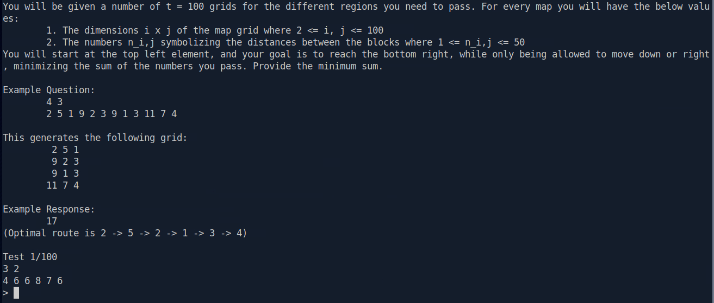

# [HTB Coding] Dynamic Paths

## Introduction

This writeup documents the solution for the **"Dynamic Paths"** coding challenge on Hack The Box, worth 975 points. In this challenge, we are tasked with navigating through a series of $100$ grid maps ($t = 100$) representing different regions. For each map, we start at the top-left corner and must reach the bottom-right corner while moving only **down** or **right**. The goal is to calculate and submit the **minimum path sum** for each grid within a strict response time limit.

---

## Preparation

Connecting to the target instance via `netcat` provides the challenge prompt and rules:

```bash
nc IP PORT
```

Upon connection, the server outputs the rules and format:



---

## Problem Analysis

### Input Format Breakdown

For each test case:
1. **Dimensions**: Two integers i (rows) and j (columns).
2. **Grid Values**: $i \times j$ space-separated integers representing the matrix row by row.

### Example Walkthrough

Given the input:
```text
4 3
2 5 1 9 2 3 9 1 3 11 7 4
```

This represents the following $4 \times 3$ grid:

$$\begin{matrix}
\mathbf{2} & \mathbf{5} & 1 \\
9 & \mathbf{2} & 3 \\
9 & \mathbf{1} & \mathbf{3} \\
11 & 7 & \mathbf{4}
\end{matrix}$$

* **Valid Moves**: Right ($\rightarrow$) and Down ($\downarrow$).
* **Optimal Route**: $2 \rightarrow 5 \rightarrow 2 \rightarrow 1 \rightarrow 3 \rightarrow 4$
* **Minimum Sum**: $2 + 5 + 2 + 1 + 3 + 4 = 17$

Because there are **100 consecutive grids** and the socket connection will time out if responses are not sent immediately, solving this manually is impossible (for me, and i don't want to). An automated solver is required.

---

## Building the Exploit / Solution Algorithm

This is a classic **Minimum Path Sum** problem on a 2D grid, which can be solved efficiently using **Dynamic Programming (DP)**.

Resources to learn DP (Thanks to all of this creator <3):
https://www.youtube.com/playlist?list=PLot-Xpze53lcvx_tjrr_m2lgD2NsRHlNO (Playlist By NeetCode)
https://www.youtube.com/watch?v=oBt53YbR9Kk (Video By freeCodeCamp.org - Alvin Zablan from Coderbyte)
https://www.geeksforgeeks.org/category/dsa/algorithm/dynamic-programming/
https://neetcode.io/roadmap (DP Route)

---

## Getting the Connection Details

The challenge instance is accessible via TCP socket:

* **Host**: `IP`
* **Port**: `PORT`

---

## Executing the Exploit

I automate the interaction using Python's `pwntools` library.

### Python Solver Script (`solve.py`)

```python
from pwn import *

# Server connection parameters
HOST = "IP" # Your IP
PORT = 12345 # Your PORT 

def solve_grid(rows, cols, values):
    grid = [values[k * cols : (k + 1) * cols] for k in range(rows)]
    dp = [[0] * cols for _ in range(rows)]
    
    dp[0][0] = grid[0][0]
    
    # Initialize first row
    for j in range(1, cols):
        dp[0][j] = dp[0][j - 1] + grid[0][j]
        
    # Initialize first column
    for i in range(1, rows):
        dp[i][0] = dp[i - 1][0] + grid[i][0]
        
    # Fill DP table
    for i in range(1, rows):
        for j in range(1, cols):
            dp[i][j] = grid[i][j] + min(dp[i - 1][j], dp[i][j - 1])
            
    return dp[rows - 1][cols - 1]

def main():
    r = remote(HOST, PORT)

    for t in range(1, 101):
        r.recvuntil(f"Test {t}/100\n".encode())
        
        # Read dimensions (rows cols)
        dim_line = r.recvline().decode().strip()
        while not dim_line:
            dim_line = r.recvline().decode().strip()
        rows, cols = map(int, dim_line.split())
        
        # Read grid values
        values_line = r.recvline().decode().strip()
        values = list(map(int, values_line.split()))
        
        # Solve minimum path sum
        ans = solve_grid(rows, cols, values)
        print(f"[*] Test {t}/100 ({rows}x{cols}) -> Minimum Sum: {ans}")
        
        # Send result back
        r.sendline(str(ans).encode())

    # Receive final flag
    print("\n[+] Flag :", r.recvall().decode())

if __name__ == "__main__":
    main()
```

### Running the Script

1. Install prerequisites:
   ```bash
   pip install pwntools
   ```

2. Execute the script:
   ```bash
   python solve.py
   python3 solve.py
   ```

---

## Verifying the Result & Getting the Flag

When executed, the script processes each grid test case seamlessly:

```text
[+] Opening connection to **IP** on port xxxxx: Done
[*] Test 1/100 (4x4) -> Minimum Sum: 24
[*] Test 2/100 (10x8) -> Minimum Sum: 152
...
[*] Test 100/100 (100x100) -> Minimum Sum: 2489
[+] Flag: HTB{---_---_---}
```

---

## Conclusion

What initially seemed like an exhausting manual task of navigating 100 different map grids is easily automated using basic algorithmic concepts. By identifying the underlying structure as a 2D Minimum Path Sum problem, i applied Dynamic Programming to achieve an optimal solution. Combining the algorithm with `pwntools` socket automation allowed us to solve all 100 tests in under two seconds and retrieve the flag. Spending WEEKS learning and mastering DP, only to watch the script demolish the entire challenge in under two seconds. 
