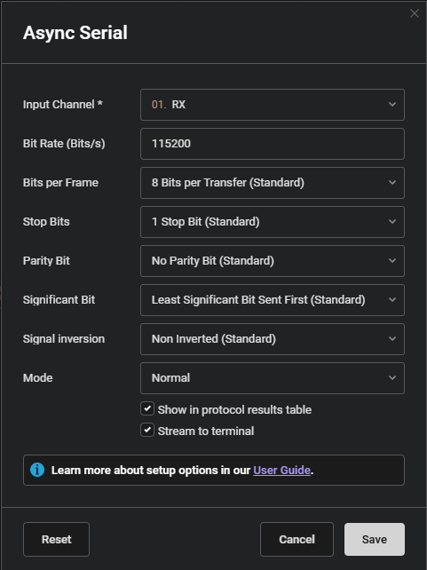
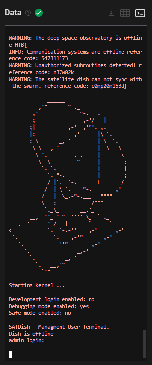

# [HTB Hardware] Debug

## Introduction

This challenge is titled **"Debug"**, part of the hardware category, worth 925 points. According to the scenario, the team has recovered a satellite dish that was used for transmitting the location of the relic, but it seems to be malfunctioning. There is some interference affecting its connection to the satellite system, but there are no indications of what it could be. The debugging interface might provide some insight, but the team is unable to decode the serial signal captured during the device's booting sequence. My task was to decode that signal and find the source of the interference.

## Preparation

I started by downloading the scenario file provided through the **Scenario Files** button. The archive contained a single file:

```
hw_debug.zip
 hw_debug.sal
```

The `.sal` extension is not a standard file type, so the first step was to figure out what it actually was.

## Identifying the File Format

Running `file` against the archive showed that it was actually a zip container:

```
hw_debug.sal: Zip archive data, at least v2.0 to extract
```

Extracting it revealed the internal structure of a Saleae Logic 2 capture:

```
hw_debug/
 digital-0.bin
 digital-1.bin
 meta.json
```

Looking at `meta.json`, the capture used two digital channels named **TX** and **RX**, sampled at 25 MHz for a total duration of about 37.5 seconds. This confirmed the file was a raw logic analyzer capture, most likely of a serial (UART) debug console, matching the scenario's mention of a "debugging interface" and a "booting sequence".

I initially tried to parse `digital-0.bin` and `digital-1.bin` manually against Saleae's publicly documented binary export format, but the header fields did not line up with the documented structure. This internal `.sal` project format turned out to be different from, and undocumented compared to, the public export format, so the most reliable path forward was to open the capture directly in the official **Saleae Logic 2** software [https://www.saleae.com/downloads].

## Decoding the Serial Signal

After loading `hw_debug.sal` in Logic 2, the TX/RX waveforms were visible on the two captured channels. I added an **Async Serial** analyzer on the RX channel with the following settings:



I first tried a common default of 9600 baud, which happened to produce output that looked partially readable, but was actually a coincidental artifact rather than a correct decode. Switching to **115200 baud** produced a fully clean, error-free decode in the Terminal view, confirming it was the correct bit rate for this capture.


## Terminal view



## Identifying the Flag

Buried in the middle of the boot log, between the network information banner and the kernel start, the device logged four warning and info lines whose "reference code" values, when concatenated in order, form the flag itself:

```
HTB{
547311173_
n37w02k_
c0mp20m153d}
```

Assembled together:

```
HTB{---_---_---}
```

Reading each segment as leetspeak confirms the intended message, explaining the "interference" mentioned in the scenario:

- `547311173` -> **satellite**
- `n37w02k` -> **network**
- `c0mp20m153d` -> **compromised**

## Conclusion

This challenge demonstrates how useful data can be hidden inside plain boot/debug logs captured straight from a device's serial console. The main obstacle was not the decoding logic itself, but identifying the correct capture format and the correct baud rate, since an incorrect baud rate can still produce output that looks superficially valid. Once the correct 115200 baud rate was found, the async serial analyzer cleanly reconstructed the entire log, and the flag was hiding in plain sight across four consecutive log lines describing the satellite dish's compromised state.