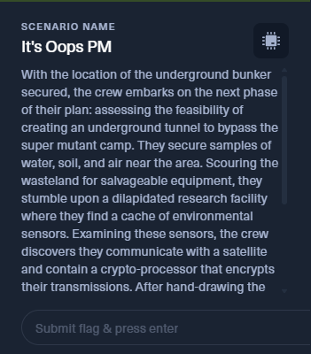
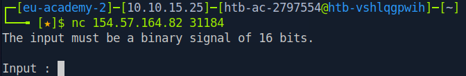
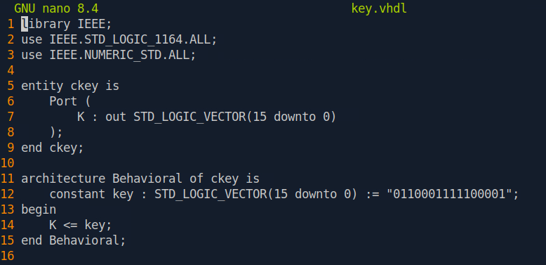
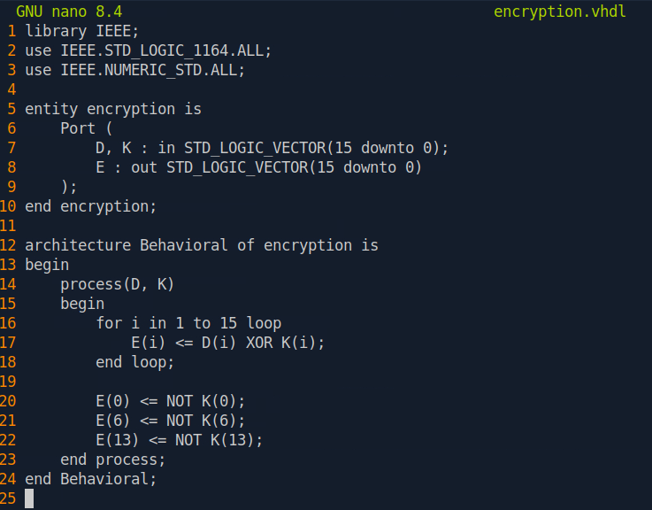
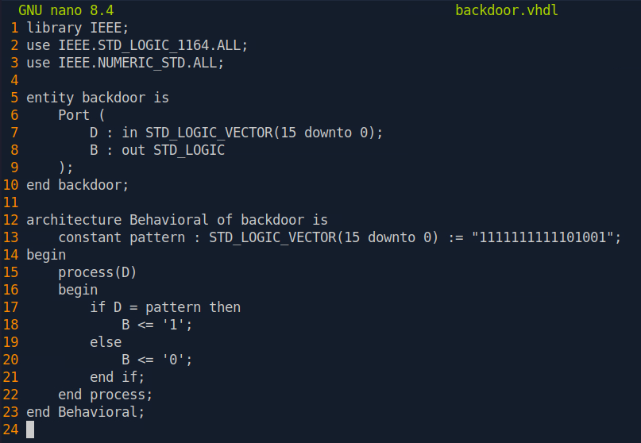
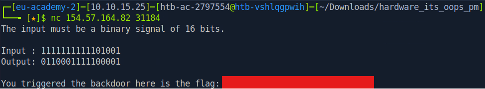

# It's Oops PM 

## Introduction

This challenge is titled **"It's Oops PM"**, part of the hardware category, worth 850 points. According to the scenario, the team discovers an environmental sensor that communicates with a satellite through a crypto-processor. After hand-drawing the diagrams and emulating the chip's logic in VHDL, they uncover what appears to be a backdoor embedded in the logic, which only triggers under a specific input. My task was to analyze that logic, find a way to trigger the backdoor, and then connect to the satellite to retrieve the flag.



## Preparation

I started by downloading the scenario files provided through the **Scenario Files** button. After extracting the archive, the following five files were included:

```
hardware_its_oops_pm/
 key.vhdl
 encryption.vhdl
 tpm.vhdl
 backdoor.vhdl
 schematic.png
```

I also obtained the address and port needed to connect to the satellite via the **Spawn Docker** button:

```
nc 154.57.164.82 31184
```



## Schematic Analysis

Before diving into the VHDL code line by line, I first looked at the block diagram in `schematic.png` to get a general understanding of the data flow.


The diagram shows four main blocks:

- **Input** : receives the incoming data
- **Key** : generates the internal key
- **Crypto** : encrypts the data using the key
- **Logic** : processes the input to produce a control signal
- **Mux** : selects the final output based on the signal from the Logic block, choosing between the encrypted data or an alternate path

This pattern hints at a possible alternate (bypass) path on the final output, controlled by the Logic block. This is what we needed to trace further in the VHDL source.

## VHDL Source Analysis

### 1. key.vhdl


This module is straightforward, it simply outputs a hardcoded 16-bit constant as the internal key:

```
Key = 0110001111100001
```

### 2. encryption.vhdl



This module takes the data (`D`) and the key (`K`), then XORs each bit from index 1 to 15. Bits 0, 6, and 13 are handled differently, their value is the negation (`NOT`) of the corresponding key bit, rather than an XOR with the data. This is the chip's main encryption routine.


### 3. backdoor.vhdl



This is the most important part. This module compares the input data (`D`) against a fixed constant:

```
pattern = 1111111111101001
```

If the data sent matches the `pattern` **exactly**, the output signal `B` is set to `'1'`. This is the control signal seen feeding into the **Logic** block in the schematic above.


### 4. tpm.vhdl (top module)

```vhdl
begin
    ck : ckey port map(Key);
    enc: encryption port map (Data, Key, Encrypted);
    bd: backdoor port map (Data, B);

    process(Key, Encrypted, B)
    begin
        case B is
            when '1' =>
                for i in 0 to 15 loop
                    Output(i) <= Key(i);
                end loop;
            when others =>
                for i in 0 to 15 loop
                    Output(i) <= Encrypted(i);
                end loop;
        end case;
    end process;
end Behavioral;
```

This `tpm` module ties all the previous components together. The logic is clear:

- If B = 1 (backdoor triggered) | Output = Key (the raw internal key is output, bypassing encryption entirely)
- If B = 0 (normal condition) | Output = Encrypted (properly encrypted data, as intended)


## Identifying the Backdoor

Based on the four files above, the overall logic can be summarized as follows:

1. The chip is designed to encrypt every piece of data that passes through it, using the internal `Key`
2. However, there is a special condition (the backdoor): if the input data exactly matches a specific pattern (`1111111111101001`), the encryption mechanism is bypassed, and the chip instead **leaks its internal Key in the clear**

In other words, sending the following data is enough to trigger the backdoor:

```
D = 1111111111101001   (binary)
D = 0xFFE9              (hexadecimal)
```

And the system will respond with the raw Key:

```
Key = 0110001111100001   (binary)
Key = 0x63E1               (hexadecimal)
```

## Connecting to the Satellite

With this understanding, I connected to the satellite using `nc`, based on the information from the **Spawn Docker** page:

```bash
nc 154.57.164.82 31184
```

When prompted for input, I sent the backdoor trigger pattern I had identified:

```
1111111111101001
```



The system should respond with the raw internal Key instead of encrypted data.


## Conclusion

This challenge demonstrates how a backdoor can be embedded at the hardware description language (VHDL) level, hidden among otherwise legitimate logic such as an encryption routine. By systematically reading the code module by module, starting from the key source, through the encryption process, to the control signal. And finally the backdoor could be identified without any complex simulation, simply by tracing the `if D = pattern` condition that triggers the security bypass in the system.