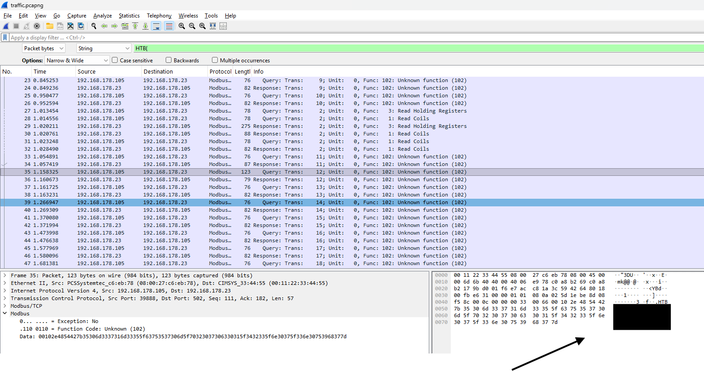

# [HTB ICS] Shush Protocol

## Analyzing traffic.pcapng

Finding the flag from `traffic.pcapng` is by far the easiest for me since the flag follows the standard Hack The Box CTF format (`HTB{...}`).

### Steps in Wireshark:

1. **Open the PCAP File:**
   Open `traffic.pcapng` using **Wireshark**.

2. **Search for the Flag String (`Ctrl + F`):**
   * Press `Ctrl + F` to open the *Find Packet* bar.
   * Change the search filter type from Display filter to **String**.
   * Change the search area (*Search in*) to **Packet bytes**.
   * Enter the search string: `HTB{`

3. **Retrieve the Flag:**
   * Click **Find** or press `Enter`.
   * Wireshark will directly highlight the packet containing the flag (`HTB{...}`) in the *Packet Bytes* pane.
  
  
